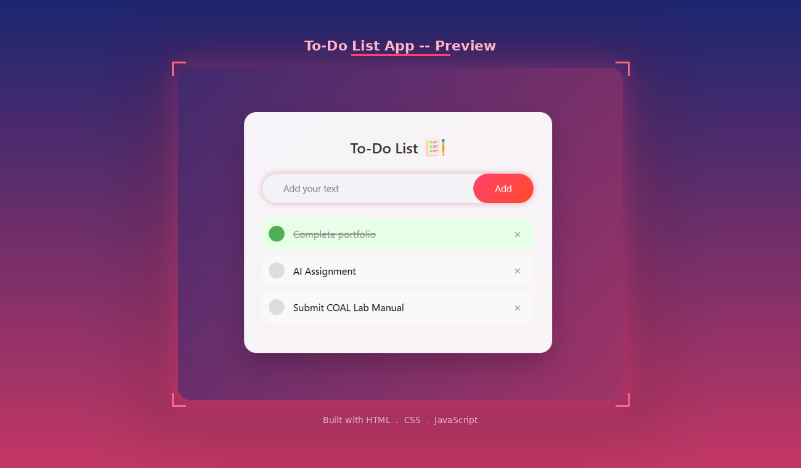

# To-Do List App

A clean and minimal To-Do List app built with pure **HTML**, **CSS**, and **JavaScript**. Add tasks, mark them as complete, delete them, and have everything saved automatically using localStorage so your tasks persist across page refreshes.

---

## Preview



---

## Features

- Add tasks with the input box and Add button
- Click a task to toggle it as completed (strikethrough + green highlight)
- Delete any task with the X button (rotates on hover)
- Tasks are saved to localStorage and restored on refresh
- Smooth animations on add, complete, and delete
- Bouncing icon in the header
- Responsive layout with a purple-to-pink gradient background

---

## Project Structure

```
ToDoList/
├── index.html        # Markup and structure
├── style.css         # Styling and animations
├── script.js         # Task logic and localStorage
├── preview.png       # Screenshot for README
└── images/
    └── icon.png      # To-Do icon in the header
```

---

## Getting Started

1. Clone the repo
   ```bash
   git clone https://github.com/your-username/todo-list.git
   cd todo-list
   ```

2. Open in browser
   ```bash
   open index.html
   ```

No setup or dependencies needed.

---

## How It Works

Every time a task is added, checked, or deleted, the inner HTML of the list container is saved to localStorage:

```js
function saveData() {
  localStorage.setItem("data", listContainer.innerHTML);
}

function showTask() {
  listContainer.innerHTML = localStorage.getItem("data");
}
```

When the page loads, `showTask()` restores the saved tasks automatically.

---

## Customization

### Change the gradient background
In `style.css`, update the `.container` background:
```css
.container {
  background: linear-gradient(135deg, #1d2671, #c33764);
}
```

### Change the Add button color
```css
button {
  background: linear-gradient(135deg, #ff416c, #ff4b2b);
}
```

### Change completed task highlight
```css
ul li.checked {
  background: #e6ffe6;
  color: #888;
}
ul li.checked::before {
  background: #4caf50;
}
```

---

## Animations

| Animation | Effect |
|-----------|--------|
| `fadeIn` | App card fades and slides up on load |
| `slideIn` | Each new task slides in from the left |
| `bounce` | Header icon bounces up and down |
| Span hover | Delete X rotates 90 degrees on hover |

---

## Color Palette

| Element | Color |
|---------|-------|
| Background | `#1d2671` to `#c33764` gradient |
| Card | `rgba(255,255,255,0.95)` white |
| Add button | `#ff416c` to `#ff4b2b` coral/red |
| Checked task | `#e6ffe6` light green |
| Check circle | `#4caf50` green |

---

## Author

**Kaneeza Batool**
CS Undergraduate, Sukkur, Pakistan
Built with HTML, CSS and JS
